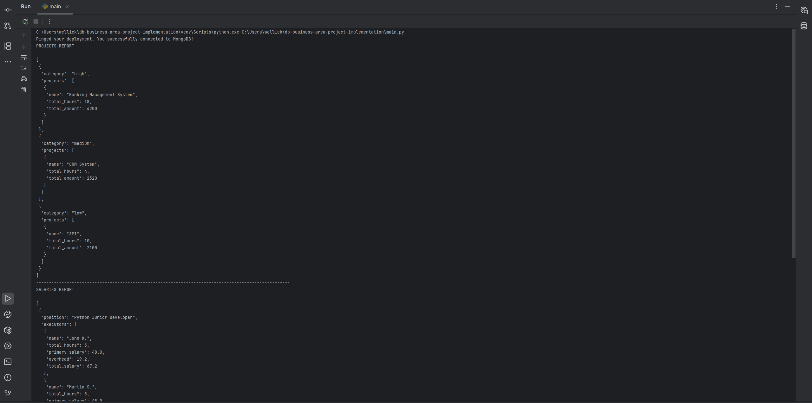
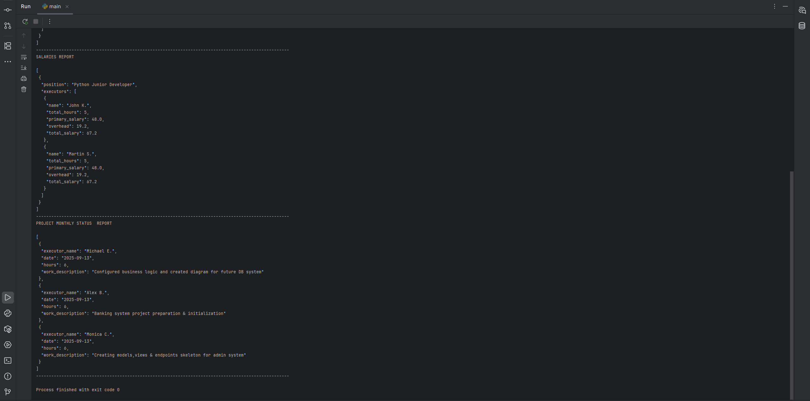

# Project Execution Information System (NoSQL DB)

## Description

An information system for organizations that manage and execute customer projects.  
Built with **MongoDB** and **Python**, it manages projects, executors, time tracking, reports, payments, and salaries.

## Features

- Project and executor accounting
- Daily work reports (tasks + hours)
- Salary calculation with position/qualification coefficients
- Monthly project billing with 40% overhead
- Payment control (customers with overdue invoices >3 months cannot start new projects)
- Validation (max 10 hours/day per executor)

## Reports

- Projects list with total work and payments (grouped by categories)
- Payroll report by month (grouped by positions)
- Work report for a project by month

## Project Document Collection Structure

```
### NoSQL Document Structure

 Project
 ├─ id
 ├─ name
 ├─ customer
 ├─ project_lead
 ├─ planned_duration_days
 ├─ category
 ├─ category_coef
 ├─ start_date
 └─ Executors [ ]
 │    ├─ executor_id
 │    ├─ name
 │    ├─ position
 │    ├─ position_coef
 │    ├─ qualification
 │    └─ hourly_rate
 ├─ Payments [ ]
      ├─ payment_id
      ├─ project_id
      ├─ month
      ├─ initial_amount
      ├─ overhead
      ├─ total_amount
      ├─ paid
      └─ payment_date
                

```


## Console output example




## Project structure
```aiignore
nosql_projects_db/
│
├── collections/           # json data 
│   ├── executors.json        
│   ├── payments.json         
│   ├── projects.json          
│   ├── reports.json 
│
├── engine/                # db initialization
│   ├── db_init.py
│
├── reports/               # report generation
│   ├── report_project_status_monthly.py
│   ├── report_projects.py
│   ├── report_salaries.py
│
├── scripts/              # utils scripts for data management
│   ├── calculate_salary.py  
│   ├── constraints.py 
│   ├── insert_data.py    
│
│── main.py  # Testing/demo/
```

### Installation

```
git clone https://github.com/mwellick/db-business-area-project-implementation.git
cd db-business-area-project-implementation

#for Windows
python -m venv venv 
.\venv\Scripts\activate 

#for MacOS/Linux
python3 -m venv venv 
source venv/bin/activate

# Requirements installation:
pip install -r requirements.txt
```

#### !  Don't forget to create .env file and add the following env.variables form .env.sample file

```
#run project 
python main.py
```

## Tech Stack

- **MongoDB** (NoSQL)
- **Python 3.13**
- **JSON** for data 

